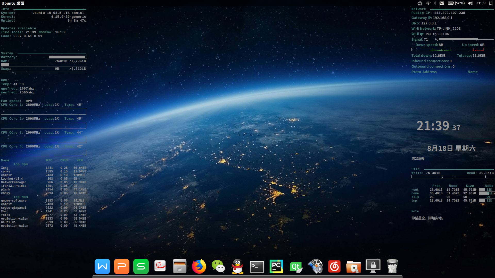
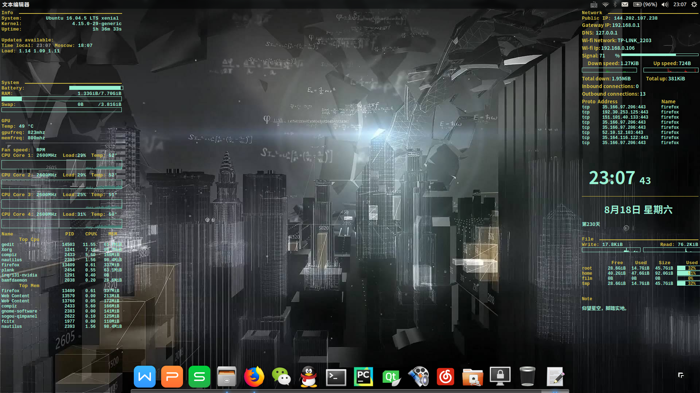

## Cooler Conky



## Recreate
- https://github.com/alexbel/conky.git  

## Download
- `git clone https://github.com/caiyufeng/conky.git  ~/.conky`  

## Revise
修改secrets.yml里面的分区路径，用于file模块显示内存占比
修改file.conf里面的note文件路径，用于file模块显示文件内容
- `gedit ~/.conky/secrets.yml`
- `gedit ~/.conky/configs/file.conf`  

## Install
ruby & conky
- `sudo apt-get install ruby`
- `sudo apt-get install conky`
sensors:
- `sudo apt-get install lm-sensors`
- `sudo sensors-detect `
- `service module-init-tools start`
other dependencies:
- curl
- ss
- acpi
- conky-imlib2  

## Autostart：
- `cd ~/.config/autostart`
- `gedit conky.desktop`  
fill it in with the following contents:  
```
[Desktop Entry]
Name=conky
Exec=cd ~/.conky && ruby starter.rb
Type=Application
Terminal=false
```  

## Restart
```
#! /bin/bash
sudo killall $"conky"
cd ~/.conky/
./starter.rb
```  
## Error mounting sda8：  
- sudo ntfsfix /dev/sda8  

## More questions please move to the original author homepage
